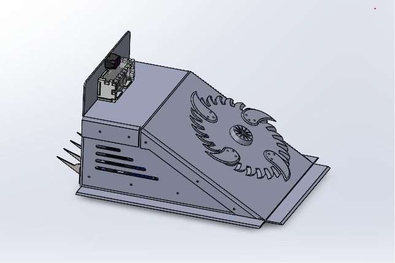
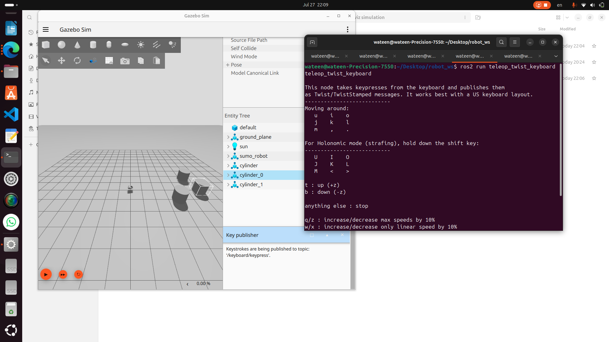
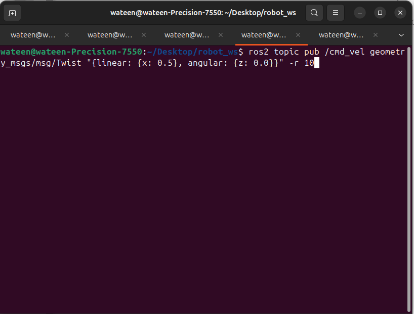
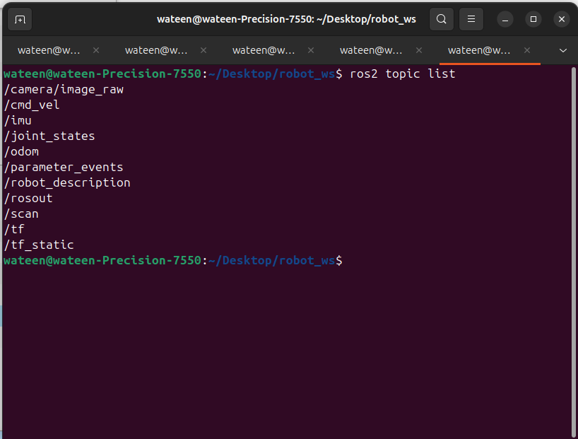
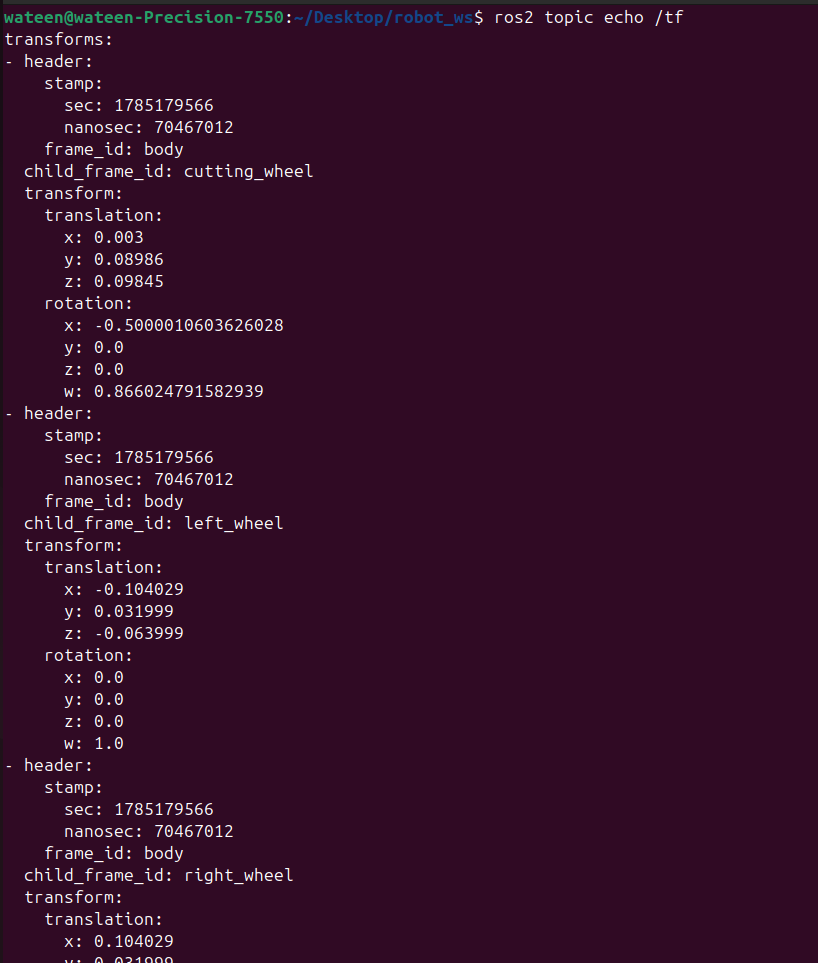
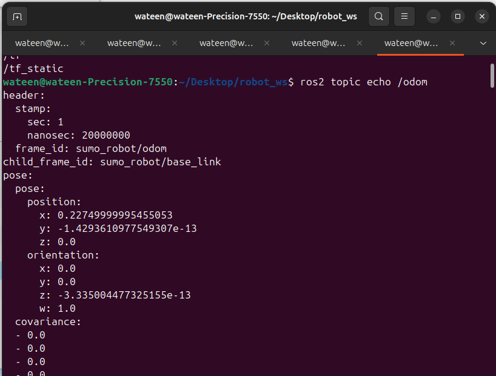
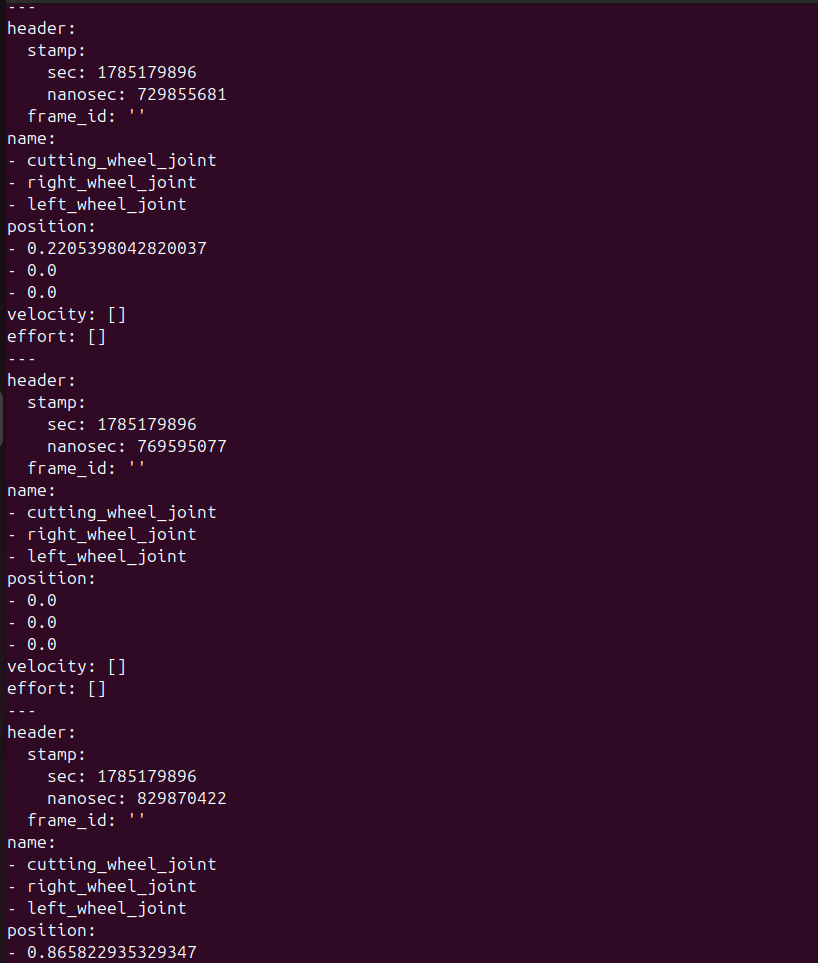
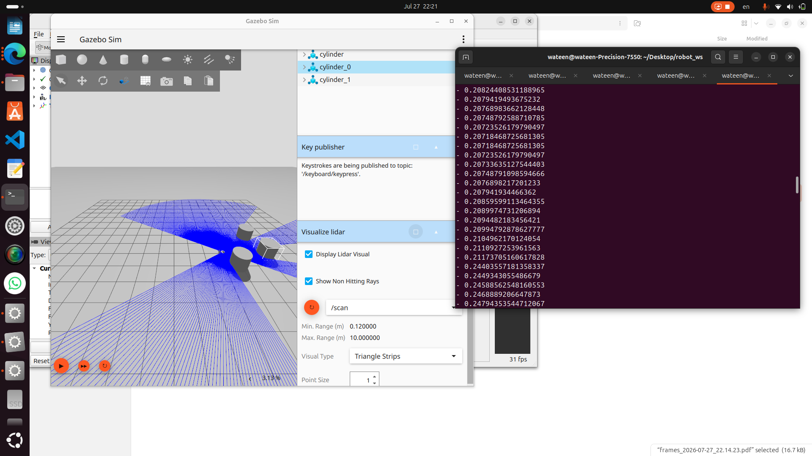
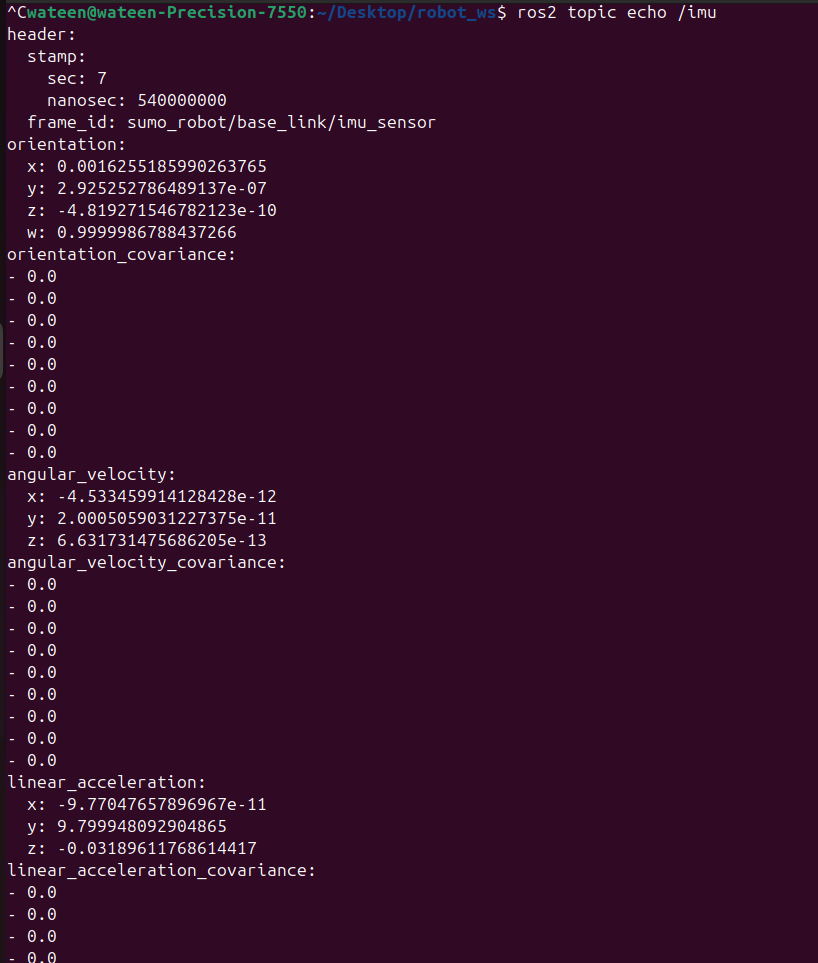
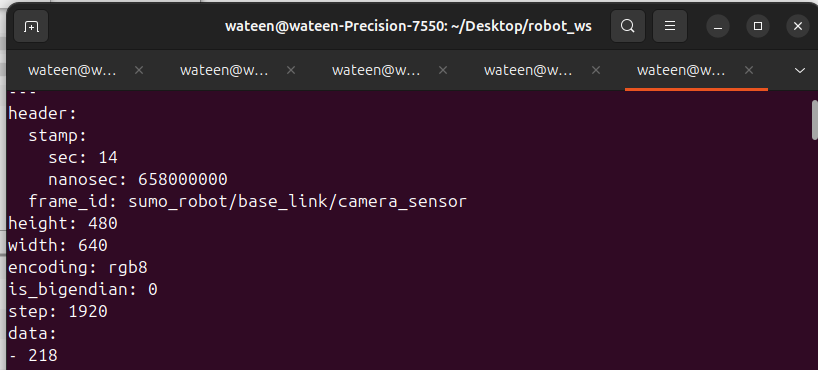

# Autonomous Sumo Robot - ROS 2 Jazzy & Gazebo Harmonic

## 🤖 1. Robot Design & Mechanical Overview
This project presents an autonomous Sumo Robot designed for competitive ring matches. The robot features a low-profile sheet metal chassis that provides high strength, durability, and impact resistance. The chassis acts as both an offensive and defensive structure, with a sloped front profile that improves engagement and pushing performance. 

Most mechanical and electronic components are arranged symmetrically. A low-angle front wedge allows the robot to slide underneath the opponent, while a rotating conical attack mechanism—powered by a high-speed 12,000 RPM DC motor—enhances the initial impact. The rear is equipped with pointed teeth that improve resistance against rear attacks. 

The robot is driven by two GGP DC gear motors (15 kg·cm torque each) in a differential drive configuration, supported by two caster wheels to maintain balance across the long chassis. A carefully calculated low center of gravity improves traction and significantly reduces the risk of tipping during matches.

---

## ⚙️ 2. Mechanical Specifications
| Item | Specification |
| :--- | :--- |
| **Chassis Material** | Sheet Metal |
| **Drive System** | Differential Drive |
| **Drive Motors** | 2 × GGP DC Gear Motors (15 kg·cm Torque) |
| **Attack Motor** | 12,000 RPM DC Motor |
| **Front Mechanism** | Low-angle Wedge + Rotating Conical Nose |
| **Rear Mechanism** | Pointed Teeth |
| **Support Wheels** | 2 Caster Wheels |
| **Chassis Type** | Low-profile Symmetrical Design |
| **Cooling** | Side Ventilation Slots |

* **Overall Dimensions (L x W x H):** 0.49 m × 0.35 m × 0.23 m
* **Ground Clearance:** 4 mm (0.015 m in URDF collision offset)
* **Wheel Radius:** 0.0425 m
* **Wheel Separation:** 0.208058 m
* **Robot Front Direction:** +X Axis
* **Attack Mechanism Joint:** Continuous joint, generating 500 N.m effort at 20 rad/s velocity.

### Mass & Center of Mass (CoM)
* **Main Body:** Mass = 10.26 kg | CoM = (0.00, 0.02, 0.03)
* **Wheels (Each):** Mass = 0.10621 kg | CoM = (0.0, 0.0, 0.0)
* **Cutting Wheel:** Mass = 0.17182 kg | CoM = (0.0, 0.0, 0.00294)
* **Caster Wheels:** Mass = 0.05 kg
* **LiDAR Sensor:** Mass = 0.05 kg

### 🔗 CAD Files
The complete SolidWorks assembly and STL files can be accessed here:<br>
**[Sumo Robot CAD Files - Google Drive](https://drive.google.com/drive/folders/1g_0e8HOjB4JpKE2sZYNPQlGbvjTNRJ2n)**

---

## 👁️ 3. Sensor Configuration
* **Camera:** Positioned at the front (X: 0.00021, Y: 0.17035, Z: -0.169), pitched slightly downwards to detect the arena floor and opponents. 
  * **Horizontal FOV:** 1.89 rad (~108 degrees)
  * **Resolution:** 640x480 (R8G8B8 format)
* **LiDAR:** 360-degree 2D sensor for spatial mapping and obstacle detection.

---

## 💻 4. Software Details & Dependencies
* **OS:** Ubuntu 24.04 (or compatible)
* **ROS Version:** ROS 2 Jazzy
* **Simulator:** Gazebo Harmonic
* **Dependencies:** `ros_gz_bridge`, `teleop_twist_keyboard`, `rqt_image_view`, `rviz2`.

---

## 🚀 5. How to Build and Run (Execution Commands)
These are the exact commands utilized to compile the workspace, launch the simulation, and open the visualizations.

**1. Build the workspace and source the setup:**
```bash
colcon build
source install/setup.bash
```

**2. Launch Gazebo with an empty world:**
```bash
ros2 launch ros_gz_sim gz_sim.launch.py gz_args:=empty.sdf
```

**3. Spawn the robot using the launch file:**
```bash
ros2 launch robo spawn.launch.py
```

**4. Open the URDF in RViz for visualization:**
```bash
ros2 launch urdf_tutorial display.launch.py model:=src/robo/urdf/robot.urdf
```

**5. View the live camera stream:**
```bash
ros2 run rqt_image_view rqt_image_view
```

---

## 🔍 6. Verification & Debugging Commands
**List all active topics:**
```bash
ros2 topic list
```

**Generate TF Frames Tree (Generates `frames.pdf`):**
```bash
ros2 run tf2_tools view_frames
```

**Echo Sensor & State Topics:**
```bash
ros2 topic echo /odom
ros2 topic echo /tf
ros2 topic echo /joint_states
ros2 topic echo /scan
ros2 topic echo /imu
ros2 topic echo /camera/image_raw
```

---

## 📸 7. Simulation & Visualization Media

### Mechanical Assembly
<br>



### Gazebo Simulation Movement
* **Simulation Video:**<br>
  [🎬 Click here to watch Simulation Video (smulation.mp4)](submission/smulation.mp4)

* **Manual Movement:**<br>
  

* **Continuous Movement:**<br>
  

### RViz2 Sensor Visualization
* **LiDAR View:**<br>
  

* **Camera View:**<br>
  

* **TF Frames in RViz:**<br>
  

### Live Sensor Streams
* **Live Camera Stream Video:**<br>
  [🎬 Click here to watch Live Camera Stream (2026-07-27 20-09-18.mkv)](<submission/live camera stream/2026-07-27 20-09-18.mkv>)

---

## 📡 8. Important ROS 2 Topics & Frames Evidence

* **Active Topics List:**<br>
  

* **TF Frames Tree:**<br>
  [frames_2026-07-27_22.14.23.pdf](submission/frames_2026-07-27_22.14.23.pdf) (Click to view PDF)<br>
  

* **Odometry Topic (`/odom`):**<br>
  

* **Joint States Topic (`/joint_states`):**<br>
  

* **LiDAR Scan Topic (`/scan`):**<br>
  

* **IMU Topic (`/imu`):**<br>
  

* **Camera Raw Topic (`/camera/image_raw`):**<br>
  
